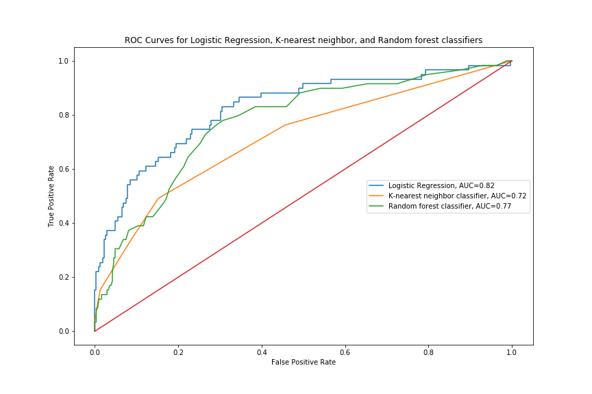
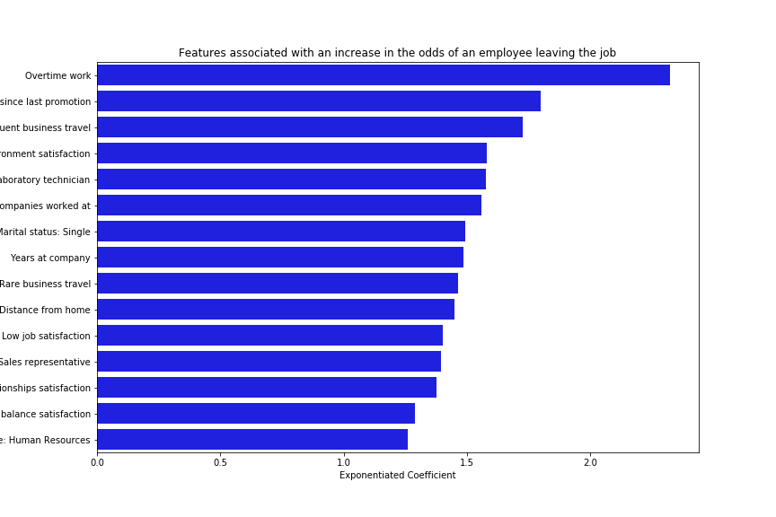
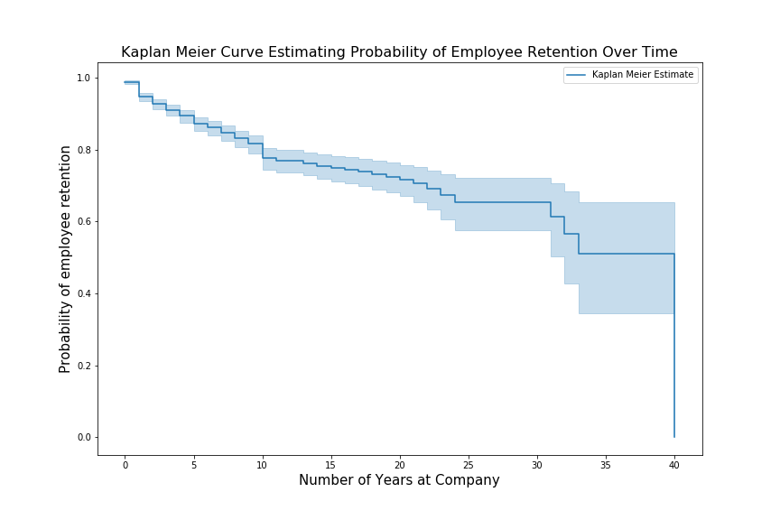
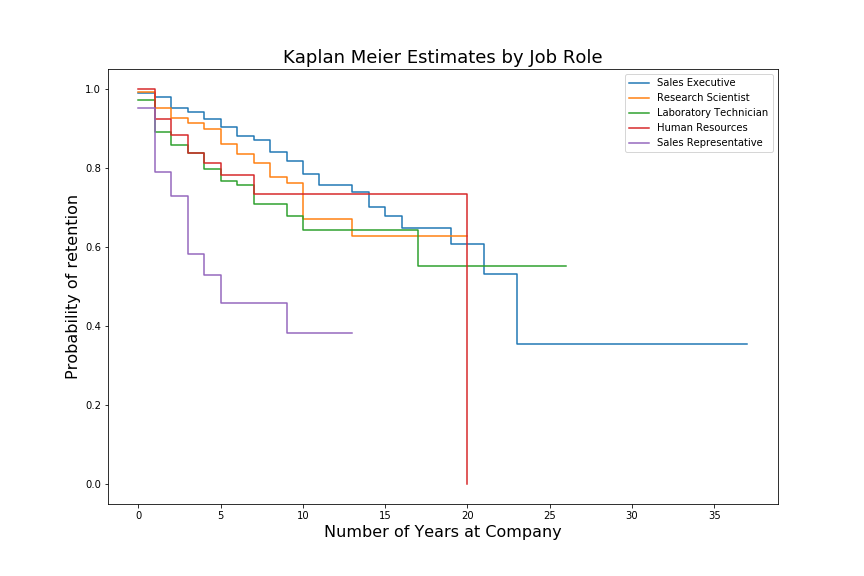

## Problem Statement:

Human Resources departments work to recruit and retain top talent to drive business goals. Employee attrition occurs when an employee leaves a position due to personal or professional reasons. This can create disruptions in project implementation and increased costs associated with hiring and training new employees. Thus, minimizing employee attrition is in the best interests of Human Resources departments.

Using employee characteristics and job attributes data from [Kaggle's IBM HR Analytics Employee Attrition & Performance](https://www.kaggle.com/datasets/pavansubhasht/ibm-hr-analytics-attrition-dataset) dataset, this analysis will serve as a model in supporting Human Resources departments to create machine learning models that:

* Predict employee attrition
* Identify the main predictors of employee attrition

A survival analysis will be used to evaluate how the probability of employee attrition varies over time. With this information, Chief People Officers and other strategic decision-makers can design employee retention programs that reduce the likelihood of attrition and enhance continuity of projects.

## Modeling Task:

Estimate attrition using logistic regression, K-nearest neighbors, Random Forest, Gradient Boosting classifiers. Using these estimators, create a model that will maximize:

* Precision: the proportion of true predictions of employee attrition out of all predictions of attrition
* Recall: the proportion of true cases of employee attrition out of all true cases of employee attrition

Also, using a Receiver Operating Characteristic (ROC) curve, maximize the true positive rate while minimizing the false positive rate.

This evaluation will help Human Resources departments correctly identify employees at higher risk of attrition.

After fitting multiple models also searching for the combination of hyperparameters and cross validation that produce the highest precision and recall scores, the table below summarizes the performance of each of these models. The logistic regression model produces the highest accuracy, precision, and recall scores compared to the other models.

|Estimator|Hyper-parameters|Accuracy Score |Precision Score|Recall Score|
|---|---|---|---|---|
|Logistic Regression|Solver: `liblinear`; penalty: `l1`|88%|72%|43%|
|k-Nearest Neighbors|Number of neighbors:9; Power parameter of Minkowski metric: 1; Weight function: uniform|84%|58%|15%|
|Random Forest|Default|86%|74%|18%|

The ROC curves plot the relationship between the true positive rate and the false positive rate. The curve farthest away from the diagonal line represents the best model because it correctly identifies true instances of employee attrition compared to other models. The logistic regression model provides the best result also demonstrated by the highest AUC score.

Fitting a logistic regression model and exponentiating the resulting coefficients allows to draw conclusions about which factors are most significant in predicting employee attrition.

Exponentiating the coefficients from the logistic regression using the complete data set allows computing the odds ratios of employees leaving their jobs. From the plot above focusing on the features associated a likelihood of 20% or higher of attrition, it can be seen that:

* Employees who work over time are more than twice as likely to quit their jobs than to stay
* An additional year since the last promotion increases the odds of an employee quitting by more than 50%
* Frequent business travel increases the odds of an employee quitting by more than 50% and rare business travel increases the odds by close to 50%
* Low work environment, relationship, and overall job satisfaction and work-life balance are associated with higher odds of employees leaving their jobs. These employees are significantly more likely to leave their jobs than to remain.
* An additional increase in the number of companies an individual has worked at is associated with an increase in the odds of quitting of more than 50%
* Job roles such as `laboratory technician`, `sales representative, and Human Resources` are associated with a higher likelihood of attrition.
* For every additional year at the company, the odds of an employee leaving the job increases by more than 20%

Early detection of low job satisfaction and modifications to frequent business travel and other job characteristics can be put in place to reduce the odds of attrition.

## Survival analysis

To visualize the probability of attrition (and conversely retention) over time, create the Kaplan Meier Curve to analyze the retention probabilities.

The probability of employee retention decreases over time. However, the rate of the decline appears to be faster within the first 10 years of employment and after 30 years of employment.

For a select job roles, the following can be seen from the data:
* Sales Executive jobs tend to have the lowest attrition compared to other job roles and the probability of retention becomes 0 after around 23 years fo service
* Research Scientist job roles tend to have high rates of retention and the probability of retention starts to drop sharply after 10 years of service
* Laboratory technician roles tend to have a high decline in job retention in the first five years of service decreasing from 100% to around 80%
* For Human Resources positions, after around seven years of service and up to 20 years of service, the probability of retention appears to be stable at around 70% and declines sharply to 0% after 20 years of service
* Sales Representative jobs have the largest decline in employee retention within the first five years of service

## Conclusion

A logistic regression model can be a useful tool to predict employee turnover and identify the employee and job characteristics most associated with higher odds of attrition. A survival analysis can be used to evaluate the probability of employee retention and conversely attrition over time by relevant job characteristics such as department and job role.
